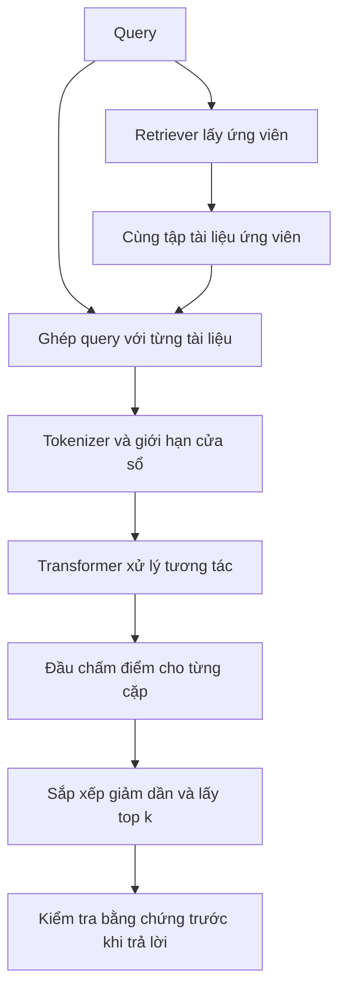

# Evidence Depth: benchmark reranker Việt–Anh

Bài kiểm tra này đo khả năng **đưa bằng chứng đáp ứng đúng yêu cầu lên trước tài liệu chỉ giống từ khóa**.

**Quy mô:** 28 tình huống · 56 câu hỏi Việt–Anh · 336 cặp query–document/mô hình.

| Tên dùng trong báo cáo | Checkpoint / API model ID |
| --- | --- |
| BGE M3 | `BAAI/bge-reranker-v2-m3` |
| Qwen3 4B | `Qwen/Qwen3-Reranker-4B` |
| BGE Gemma2 lightweight | `BAAI/bge-reranker-v2.5-gemma2-lightweight` |
| Cohere 4.0 pro | `rerank-v4.0-pro` |
| BM25 — baseline | `local-bm25-k1=1.2-b=0.75` |

> **Trạng thái thực nghiệm:** đã chạy BGE M3 và BM25, mỗi bên 56 câu hỏi / 336 cặp.
> Qwen 4B, Gemma2 và Cohere có adapter nhưng **chưa được kiểm chứng inference** trong repo này.
> Lần chạy dùng tài nguyên hiện có; chưa có đủ kết quả để xếp hạng bốn reranker.

**Mục lục**

1. [Bài benchmark](#1-bài-benchmark)
2. [Cơ chế reranking](#2-cơ-chế-reranking)
3. [Phương pháp đánh giá](#3-phương-pháp-đánh-giá)
4. [Kết quả thực nghiệm](#4-kết-quả-thực-nghiệm)
5. [Hướng dẫn chạy](#5-hướng-dẫn-chạy)
6. [Artifact và giới hạn](#6-artifact-và-giới-hạn)

## 1. Bài benchmark

### 1.1. Ví dụ: bằng chứng đúng dưới nhiều ràng buộc

> Tìm kết quả đo chứng minh p95 latency dưới 200 ms ở tải ít nhất 1000 request/giây.

Sáu ứng viên đều có thể được retriever lấy về, nhưng khác nhau về giá trị bằng chứng:

| Ứng viên rút gọn | Grade | Vì sao |
| --- | ---: | --- |
| 1200 request/s, p95 = 180 ms trong cùng cửa sổ đo | 3 | Đáp ứng cả percentile, ngưỡng và tải |
| p95 = 180 ms, không ghi tải | 2 | Bằng chứng một phần, chưa đủ kết luận |
| Bài định nghĩa latency percentile | 1 | Cùng chủ đề, không chứng minh yêu cầu |
| 1200 request/s, p50 = 80 ms nhưng p95 = 240 ms | 0 | Đánh tráo percentile |
| p95 = 180 ms ở 100 request/s | 0 | Tải thấp hơn yêu cầu |
| 1000 request/s, p95 = đúng 200 ms | 0 | `200 < 200` sai; không được đổi “dưới” thành “không quá” |

Một mô hình nhạy với từ khóa dễ chọn hàng có nhiều số trùng nhất. Mô hình xử lý tốt yêu cầu cần phân biệt `p50/p95`, `100/1000`, `< / <=`, rồi xét đồng thời các điều kiện. Điểm cuối cùng cho biết nó xếp hạng được tới đâu; **không chứng minh nó đã suy luận theo từng bước giống con người**.

### 1.2. Dữ liệu và nhãn

- **28 tình huống**, mỗi tình huống có hai cách hỏi Việt/Anh và cùng sáu tài liệu: **56 query, 336 lần chấm cặp** cho mỗi mô hình. Có 168 candidate ID, dùng lại giữa hai ngôn ngữ.
- **Core:** 22 tình huống / 44 câu. Kiểm tra phủ định, AND/OR, số và đơn vị, thời gian, nguyên nhân, nối quan hệ, code, định danh, xuyên ngôn ngữ, prompt injection, bằng chứng đã đo và lượng từ “mọi”.
- **Long-context:** 2 tình huống / 4 câu. Bằng chứng nằm giữa/cuối phụ lục dài, có nội dung gây nhiễu hoặc bản nháp đã bị thay thế. Báo cáo riêng vì cửa sổ token có thể làm mất bằng chứng.
- **Unanswerable:** 4 tình huống / 8 câu. Không tài liệu nào có đáp án; có ca ngoài miền như cryobot Europa và ca thiếu bằng chứng về dự án hư cấu.
- Nguồn là fixture tổng hợp do tác giả benchmark xây dựng, chưa được nhiều người chấm độc lập; **không phải BEIR, MIRACL, MTEB hay dữ liệu production**. Không dùng output của reranker làm nhãn.

| Grade | Ý nghĩa |
| ---: | --- |
| 3 | Đủ bằng chứng đáp ứng yêu cầu |
| 2 | Bằng chứng một phần có ích, còn thiếu điều kiện |
| 1 | Chỉ cùng chủ đề |
| 0 | Không đáp ứng hoặc mâu thuẫn yêu cầu |

Grade 2 **không** được dùng để khẳng định toàn bộ yêu cầu đã đạt. Vì vậy cần đọc cả **Strict@1** bên cạnh MRR và nDCG. Ví dụ hàm chỉ cài cận tuổi dưới là bằng chứng một phần về điều kiện dưới, không phải implementation hợp lệ của cả khoảng tuổi.

Đây là định nghĩa **relevance hướng tới bằng chứng thỏa ràng buộc**. Một tài liệu bác bỏ yêu cầu có thể hữu ích trong tác vụ kiểm chứng sự thật khác, nhưng được chấm 0 trong bài tìm giải pháp/bằng chứng đáp ứng yêu cầu này. Không chuyển nhãn này sang tác vụ fact-checking mà giữ nguyên cách diễn giải.

Nguồn có thể sửa tại [scripts/build_dataset.py](scripts/build_dataset.py); bản đóng băng để chạy nằm ở [data/evidence_depth.jsonl](data/evidence_depth.jsonl). Mỗi tài liệu có `grade` và `rationale`. Backend chỉ nhận chuỗi query và văn bản tài liệu; không nhận nhãn, lý do hay ID. ID không mã hóa nhãn; thứ tự ứng viên được xáo trộn bằng seed cố định trước khi chạy. Các câu VI/EN thuộc cùng `group_id` và không được coi là các mẫu độc lập trong bootstrap.

## 2. Cơ chế reranking

### 2.1. Từ retrieval tới reranking



Embedding thường mã hóa `q` và `d` riêng rồi so cosine hoặc dot product. Cross-encoder xử lý cặp cùng nhau: biểu diễn một từ trong tài liệu có thể phụ thuộc vào câu hỏi. Cùng tài liệu “không lưu số thẻ” sẽ có giá trị khác với query “không lưu thẻ” và query “cần lưu thẻ offline”.

Trong một attention head, với ma trận trạng thái token `H`, ta tính các phép chiếu `Q = HW_Q`, `K = HW_K`, `V = HW_V`, rồi:

```math
\mathrm{Attention}(H)=\mathrm{softmax}\left(\frac{QK^\top}{\sqrt{d_k}}+M\right)V.
```

Chữ `Q` trong công thức là ma trận query của attention, không chỉ chuỗi câu hỏi người dùng. `M` che các vị trí padding hoặc vị trí tương lai trong decoder. Nhiều lớp attention, residual connection và feed-forward cập nhật biểu diễn; đầu ra cuối được chuyển thành một scalar `s(q,d)`.

Các trọng số có thể học những tương tác như “không” với “lưu”, hoặc “200” với “p95”. Tuy nhiên đây là tính toán thống kê trên biểu diễn đã học: không có cam kết mô hình sẽ thi hành mọi toán tử logic như một theorem prover. Attention map cũng không tự nó là lời giải thích nhân quả cho score.

Đối với các adapter local ở đây, cách chấm là **pointwise**: mỗi cặp có một score riêng, sau đó mới sort cả tập. Việc batching nhiều cặp để tăng tốc không làm chúng được suy luận chung như listwise ranking. Reranker không tự lấy lại tài liệu bị retriever bỏ sót. Bộ benchmark cố định candidate pool, nên đo riêng bước sắp xếp; candidate coverage của các câu có đáp án bằng 100% do thiết kế, không phải một thành tích của retriever.

### 2.2. BGE M3: encoder và đầu phân loại

Checkpoint dùng `XLMRobertaForSequenceClassification`: 24 lớp, hidden size 1024, 16 attention heads. Query/document được tokenizer ghép với special token, đưa qua encoder có attention hai chiều. Đầu phân loại XLM-R lấy hidden state token đầu chuỗi, qua dense/tanh và phép chiếu ra một logit. Ở chế độ `eval`, dropout không lấy mẫu ngẫu nhiên. [Cấu hình checkpoint](https://huggingface.co/BAAI/bge-reranker-v2-m3/blob/main/config.json), [mã XLM-R của Transformers](https://github.com/huggingface/transformers/blob/main/src/transformers/models/xlm_roberta/modeling_xlm_roberta.py).

Viết giản lược:

```math
\begin{aligned}
h &= \mathrm{Encoder}([q;d])_{0} \\
z &= w^\top\tanh(Wh+b)+c \\
s &= \sigma(z)=\frac{1}{1+e^{-z}}
\end{aligned}
```

Repo giữ **raw logit `z`** để tránh sigmoid bão hòa làm mất độ phân giải. Vì sigmoid đơn điệu, thứ hạng lý tưởng của `z` và `sigmoid(z)` giống nhau. Điểm âm hoàn toàn bình thường. Không diễn giải `sigmoid(z)=0.9` thành “90% bằng chứng đúng”. Model card cung cấp cả cách dùng `AutoModelForSequenceClassification` và FlagEmbedding. [BGE M3 model card](https://huggingface.co/BAAI/bge-reranker-v2-m3).

### 2.3. Qwen3 4B: decoder dùng để chấm cặp

Qwen nhận instruction, query và document trong một prompt; decoder xử lý với causal mask. Vị trí đánh giá ở cuối đã nhìn được query lẫn tài liệu trước đó. Adapter đọc logits của hai token `yes` và `no`, lưu hiệu `z_yes - z_no`. Nếu cần chuẩn hóa:

```math
s=\frac{e^{z_{yes}}}{e^{z_{yes}}+e^{z_{no}}}
=\sigma(z_{yes}-z_{no}).
```

Đây là softmax trên **hai lựa chọn**, không phải xác suất `yes` trên toàn vocabulary. Prompt kết thúc bằng vùng `<think>` rỗng; adapter không sinh bài giải hay chuỗi suy luận. Chấm rerank khác việc hỏi một chat model tự bịa ra điểm. Checkpoint 4B có 36 lớp, cửa sổ công bố 32K; repo dùng cửa sổ nhỏ hơn để kiểm soát tài nguyên. [Qwen model card và inference chính thức](https://huggingface.co/Qwen/Qwen3-Reranker-4B), [Qwen technical report](https://arxiv.org/abs/2506.05176).

Adapter giữ nguyên prefix/suffix, dùng left padding để vị trí cuối cùng luôn là vị trí chấm thật; chỉ giữ logits cuối bằng `logits_to_keep=1`. Prompt, dtype, revision và cửa sổ được ghi vào artifact. Instruction mặc định theo ví dụ chính thức; chưa tối ưu prompt dựa trên nhãn test. Qwen công bố huấn luyện reranker có giám sát bằng dữ liệu chất lượng cao; không được lấy quy trình huấn luyện embedding của họ rồi mặc nhiên gán cho reranker. [Giải thích kiến trúc và training của Qwen](https://qwenlm.github.io/blog/qwen3-embedding/).

### 2.4. BGE Gemma2 lightweight: cắt lớp và nén token

“Lightweight” nói về cách giảm tính toán của checkpoint dựa trên **Gemma2 9B**, không có nghĩa đây là model vài trăm triệu tham số. Cấu hình có 42 lớp, hidden size 3584, cửa sổ 8192; có thể chọn lớp dừng và tỷ lệ nén. [Model card](https://huggingface.co/BAAI/bge-reranker-v2.5-gemma2-lightweight), [config](https://huggingface.co/BAAI/bge-reranker-v2.5-gemma2-lightweight/blob/main/config.json).

Luồng adapter là `BOS + A: query + B: passage + prompt`. Với cấu hình `layer_wise=true`, mã checkpoint có các **đầu scalar**, không lấy cặp token `yes/no` như Qwen. Adapter lấy scalar ở token hợp lệ cuối cùng, dùng attention mask do model trả về sau nén. Mã áp dụng softcapping `30 * tanh(z/30)` trước khi trả logits. Không dùng mask cũ để chọn vị trí sau khi chiều dài đã thay đổi. [Mã chính thức `CostWiseGemmaForCausalLM`](https://huggingface.co/BAAI/bge-reranker-v2.5-gemma2-lightweight/blob/fabc9f6f51698e30890300fa3917f0560fdbcd75/gemma_model.py).

Nén gom các nhóm trạng thái token passage liền nhau và lấy trung bình có xét token hợp lệ; query và prompt được giữ. Với nhóm đầy đủ tỷ lệ `r`, trực giác là:

```math
\tilde h_j=\frac{1}{r}\sum_{t=rj}^{rj+r-1}h_t.
```

Nhóm cuối dùng số token thật làm mẫu số. Đây là gộp **hidden states**, không phải tóm tắt văn bản bằng một LLM khác. Chạy ít lớp hơn giảm số block; nén giảm số vị trí của các lớp còn lại. Lợi ích FLOPs không tự suy ra cùng tỷ lệ giảm latency hoặc VRAM. Chi tiết phủ định/ngưỡng số cũng có thể mất sắc nét khi gộp. [Hàm `token_compress` trong mã checkpoint](https://huggingface.co/BAAI/bge-reranker-v2.5-gemma2-lightweight/blob/fabc9f6f51698e30890300fa3917f0560fdbcd75/gemma_model.py).

Profile mặc định: `cutoff_layer=28`, `compress_ratio=2`, `compress_layers=[24]`. Nếu dừng ở 28, nén ở 40 sẽ không được thực thi; vì vậy không liệt kê lớp 40 như một tối ưu đang có tác dụng. Muốn khảo sát đánh đổi, chạy riêng các profile `42/ratio1`, `28/ratio2/layer24`, `25/ratio2/layer8`; không gộp chúng thành một dòng “Gemma” duy nhất rồi so sánh chi phí.

### 2.5. Cohere Rerank 4.0: thông tin công khai

Tên API cụ thể là `rerank-v4.0-pro` hoặc `rerank-v4.0-fast`; benchmark chính chọn **pro**, có thêm option chạy fast riêng. Công bố mô tả pro thiên về chất lượng, fast thiên về latency/throughput, cả hai có cửa sổ 32K. Những mô tả đó không phải kết quả thực nghiệm của repo. [Danh mục mô hình Cohere](https://docs.cohere.com/docs/models).

Adapter gửi `query`, danh sách `documents`, `top_n=K`, nhận `index` và `relevance_score`, rồi ánh xạ `index` về đúng tài liệu ban đầu. API có `max_tokens_per_doc`; repo đặt giá trị này rõ ràng. [Rerank API v2](https://docs.cohere.com/v2/reference/rerank).

Tài liệu best practices mô tả chấm query cùng từng chunk và lấy `max` điểm chunk khi chunking được áp dụng. Điểm trả về trong `[0,1]` vẫn phụ thuộc query và cần kiểm định ngưỡng theo dữ liệu riêng. Repo không quan sát được tokenizer, chunk thực tế hoặc số token bị cắt từ response này. [Cohere best practices](https://docs.cohere.com/docs/reranking-best-practices).

Không có đủ công bố để khẳng định số layer, tham số, attention mask, đầu `yes/no`, trọng số, loss hay chain-of-thought riêng của Rerank 4.0. Vì vậy benchmark coi đây là dịch vụ chấm điểm hộp đen và lưu thời điểm/request ID. Sơ đồ cross-encoder ở trên là giải thích họ phương pháp, không phải bản vẽ kiến trúc đã kiểm chứng của Cohere 4.0.

### 2.6. Vì sao score không phải bằng chứng đúng?

Huấn luyện ranking làm điểm của cặp phù hợp cao hơn cặp không phù hợp theo phân phối huấn luyện. Để hình dung, một loss xếp hạng đôi thường có dạng:

```math
L=\log\left(1+\exp\left[-(s(q,d^+)-s(q,d^-))\right]\right).
```

Đây là **minh họa một mục tiêu ranking**, không khẳng định cả bốn checkpoint dùng loss này. Chỉ cần phân biệt tương đối tốt có thể giảm loss, trong khi score vẫn chưa được hiệu chuẩn giữa query/domain. Nếu cả sáu tài liệu sai, vẫn tồn tại một tài liệu có điểm cao nhất. Cần lớp kiểm tra evidence/abstention riêng, không gắn ngưỡng `0.5` chung cho BGE, Qwen và Cohere.

## 3. Phương pháp đánh giá

### 3.1. Điều kiện so sánh

Mọi model nhận cùng query, cùng sáu candidate, cùng thứ tự đầu vào. BM25 tính IDF trên sáu tài liệu của từng pool; đó là baseline từ vựng trong pool, không phải BM25 toàn corpus và không phải RRF. Neural adapter không chấm trên một pool thuận lợi hơn.

BM25 ở đây không có dịch ngôn ngữ hay stemming. Nhiều query Việt đối chiếu tài liệu Anh, nên chênh lệch với BGE bao gồm cả khả năng xuyên ngôn ngữ. Không được gọi toàn bộ mức tăng là cải thiện “suy luận sâu”; cần đọc từng nhóm, từng ngôn ngữ và Strict@1.

### 3.2. Cách đọc metric

| Metric | Định nghĩa và ý nghĩa |
| --- | --- |
| nDCG@5 | `DCG = sum((2^grade-1)/log2(rank+1))`, chia DCG của thứ tự lý tưởng; rank bắt đầu ở 1 |
| MRR@5 | `1/rank` của tài liệu grade ≥2 đầu tiên trong top 5; ngoài top 5 = 0 |
| Hit@1 | Top 1 có grade ≥2: chỉ đảm bảo có ít nhất bằng chứng một phần |
| Strict@1 | Top 1 có grade =3: chỉ số trực tiếp hơn cho đáp ứng đầy đủ ràng buộc |
| Recall@3 | Số tài liệu grade ≥2 trong top 3 / tổng tài liệu grade ≥2 trong pool |
| Hard-negative win | Trung bình so sánh score của grade 3 với từng grade 0 trong cùng query; thắng=1, hòa=0.5, thua=0 |
| p50/p95, pairs/s | Thời gian mỗi query sáu tài liệu sau warm-up và thông lượng quan sát; lưu cả load/warm-up riêng |

Tie score giữ thứ tự pool đã xáo trộn chung. Query không có positive có `metrics=null`; không đặt nDCG bằng 1 hoặc lẫn vào trung bình. Score top 1 OOD chỉ để soi lỗi; chưa có dev set độc lập để đo false accept tại ngưỡng cố định.

Bootstrap so sánh **chênh lệch** nDCG theo nhóm tình huống, 2000 lần, seed cố định. Nó giữ hai ngôn ngữ của một tình huống cùng nhau. Dataset nhỏ và có cách viết theo mẫu nên CI chỉ phản ánh biến thiên trong fixture; không biến dữ liệu tổng hợp thành bằng chứng thống kê cho toàn bộ thế giới thực.

### 3.3. Cửa sổ và tính công bằng

Lần local dùng `max_length=1024`, batch 1, FP32, CPU, 4 threads. BGE cắt phía document; Qwen giữ prefix/suffix; Gemma giữ query/prompt. Mỗi cặp local ghi số token trước/sau cắt. Core phải kiểm tra không bị cắt trước khi gán lỗi cho reasoning; long-context cố ý thử chính sách cửa sổ.

1024 token giữa các tokenizer **không tương đương cùng 1024 từ**. Hơn nữa `max_tokens_per_doc` của Cohere là ngân sách document của API, không phải cùng tổng ngân sách query+document+prompt như các adapter local. Vì vậy đây là profile ngân sách được ghi rõ, **không tuyên bố điều kiện context hoàn toàn tương đương giữa local và hosted**. Khi có máy mạnh nên chạy thêm profile 8192, rồi tách báo cáo chất lượng khỏi chi phí và không trộn hai cửa sổ.

## 4. Kết quả thực nghiệm

Lần chạy ngày 2026-09-24 dùng `torch 2.14.0+cpu`, `transformers 5.17.0`, Python 3.13.13 trên Windows. Máy có RTX 3060 Laptop 6 GB nhưng runtime PyTorch đang là CPU-only; kết quả bên dưới **không phải GPU benchmark**. RAM/VRAM trống và driver được lưu tại thời điểm khởi tạo từng backend. Qwen 4B và Gemma2 9B chưa có cache và không được load trong lần giới hạn tài nguyên; Cohere chưa có `COHERE_API_KEY`.

<!-- BENCHMARK_RESULTS_START -->

### 4.1. Chất lượng và trạng thái chạy

Bảng chất lượng dùng **44 câu core / 22 nhóm độc lập**. Hai ngôn ngữ của cùng tình huống không phải hai mẫu độc lập.

| Mô hình | Trạng thái |
| --- | --- |
| BGE M3 | `complete` |
| BM25 | `complete` |
| Cohere 4.0 pro | `skipped` |
| BGE Gemma2 lightweight | `skipped` |
| Qwen3 4B | `skipped` |

**Điểm chất lượng — chỉ các lần chạy đầy đủ**

| Mô hình | nDCG@5 | MRR@5 | Hit@1 | Strict@1 | Hard-neg win |
| --- | ---: | ---: | ---: | ---: | ---: |
| BGE M3 | 0.7651 | 0.8292 | 72.73% | 56.82% | 81.82% |
| BM25 | 0.5656 | 0.5500 | 27.27% | 18.18% | 51.52% |

> **Cách đọc:** Hit@1 nhận grade ≥ 2; Strict@1 chỉ nhận grade = 3. Kết quả được sinh từ JSON; mô hình chưa chạy không được gán điểm.

- `cohere-pro`: COHERE_API_KEY is not configured.
- `gemma`: Large model loading disabled for this resource-constrained run; rerun on a suitable machine with --allow-large-models.
- `qwen4b`: Large model loading disabled for this resource-constrained run; rerun on a suitable machine with --allow-large-models.

### 4.2. Thời gian xử lý

| Mô hình | p50 (s/query) | p95 (s/query) | Cặp/giây |
| --- | ---: | ---: | ---: |
| BGE M3 | 2.348 | 14.395 | 1.89 |
| BM25 | 0.000 | 0.001 | 20254.51 |

p50/p95 tính trên toàn bộ query, một lượt sau warm-up; có tokenization, không có thời gian load. Cohere nếu chạy gồm cả network. Đây không phải phép đo throughput production hay so sánh latency trên cùng phần cứng.

### 4.3. Phân tích từng mô hình

#### BGE M3

**Theo nhóm năng lực**

| Nhóm | Số query | nDCG@5 | Strict@1 |
| --- | ---: | ---: | ---: |
| causal | 4 | 0.9324 | 100.00% |
| code | 4 | 0.7148 | 50.00% |
| conjunction | 2 | 0.9049 | 100.00% |
| crosslingual | 4 | 0.8493 | 50.00% |
| entity | 4 | 0.8524 | 75.00% |
| evidence_quality | 2 | 0.6609 | 0.00% |
| injection | 4 | 0.8556 | 75.00% |
| logic | 2 | 0.2731 | 0.00% |
| multihop | 4 | 0.8748 | 100.00% |
| negation | 4 | 0.5752 | 0.00% |
| numeric | 4 | 0.6582 | 50.00% |
| quantifier | 2 | 0.6275 | 0.00% |
| temporal | 4 | 0.8706 | 75.00% |

**Theo ngôn ngữ — chỉ core**

| Ngôn ngữ | nDCG@5 | Strict@1 |
| --- | ---: | ---: |
| `vi` | 0.7505 | 59.09% |
| `en` | 0.7797 | 54.55% |

Không diễn giải đây là đánh giá tổng quát mọi dữ liệu tiếng Việt/Anh.

**Tài liệu dài và token bị cắt**

- Long-context: nDCG@5 **0.6519**, Strict@1 **0.00%** trên 4 câu.
- Số cặp bị cắt: toàn bộ **8**, core **0**.

Nếu bằng chứng bị cắt mất, lỗi thuộc cả chính sách cửa sổ và mô hình; không kết luận mô hình không hiểu bằng chứng chưa được thấy.

**Một số ca sai có thể kiểm tra lại**

- **`or-auth-vi`** — top 1 grade **0**, đáp án đầy đủ ở hạng **6**.
  Hai nhánh đều sai. Điểm top 1: `1.367872`; điểm đáp án: `-3.450614`.

- **`or-auth-en`** — top 1 grade **0**, đáp án đầy đủ ở hạng **5**.
  Hai nhánh đều sai. Điểm top 1: `3.795702`; điểm đáp án: `-1.576579`.

- **`numeric-units-en`** — top 1 grade **0**, đáp án đầy đủ ở hạng **4**.
  Nhầm giây/phút. Điểm top 1: `1.777738`; điểm đáp án: `-1.137777`.

- **`negation-cache-vi`** — top 1 grade **0**, đáp án đầy đủ ở hạng **5**.
  Không cấm không đồng nghĩa với không lưu. Điểm top 1: `-0.591446`; điểm đáp án: `-5.206386`.

**Câu hỏi không có đáp án**

Unanswerable: **8** câu không có tài liệu đúng. Giá trị lớn nhất trong các điểm top 1 là `0.169746`.

Chỉ là chẩn đoán trong thang điểm của mô hình; chưa có ngưỡng abstain được hiệu chuẩn và không đưa các câu này vào nDCG/MRR.

**Runtime và artifact**

- Thiết bị: `cpu`; dtype: `float32`.
- Load: 44.57s; warm-up: 0.48s.
- Inference: 336 cặp / 177.91s = 1.89 cặp/s.
- Artifact: [bge-m3.json](results/local-2026-09-24/bge-m3.json).

#### BM25

**Theo nhóm năng lực**

| Nhóm | Số query | nDCG@5 | Strict@1 |
| --- | ---: | ---: | ---: |
| causal | 4 | 0.5376 | 0.00% |
| code | 4 | 0.4399 | 0.00% |
| conjunction | 2 | 0.7105 | 50.00% |
| crosslingual | 4 | 0.4109 | 0.00% |
| entity | 4 | 0.6370 | 25.00% |
| evidence_quality | 2 | 0.5548 | 0.00% |
| injection | 4 | 0.5696 | 25.00% |
| logic | 2 | 0.4352 | 0.00% |
| multihop | 4 | 0.6709 | 50.00% |
| negation | 4 | 0.4066 | 0.00% |
| numeric | 4 | 0.5429 | 0.00% |
| quantifier | 2 | 0.6278 | 0.00% |
| temporal | 4 | 0.8422 | 75.00% |

**Theo ngôn ngữ — chỉ core**

| Ngôn ngữ | nDCG@5 | Strict@1 |
| --- | ---: | ---: |
| `vi` | 0.5135 | 13.64% |
| `en` | 0.6178 | 22.73% |

Không diễn giải đây là đánh giá tổng quát mọi dữ liệu tiếng Việt/Anh.

**Tài liệu dài và token bị cắt**

- Long-context: nDCG@5 **0.5680**, Strict@1 **25.00%** trên 4 câu.
- Số cặp bị cắt: toàn bộ **0**, core **0**.

Nếu bằng chứng bị cắt mất, lỗi thuộc cả chính sách cửa sổ và mô hình; không kết luận mô hình không hiểu bằng chứng chưa được thấy.

**Một số ca sai có thể kiểm tra lại**

- **`negation-cache-vi`** — top 1 grade **0**, đáp án đầy đủ ở hạng **6**.
  Không cấm không đồng nghĩa với không lưu. Điểm top 1: `0.258996`; điểm đáp án: `0.000000`.

- **`numeric-units-vi`** — top 1 grade **0**, đáp án đầy đủ ở hạng **6**.
  Nhầm bit/byte. Điểm top 1: `2.702237`; điểm đáp án: `0.198784`.

- **`causal-incident-vi`** — top 1 grade **0**, đáp án đầy đủ ở hạng **6**.
  Không chứng minh can thiệp loại timeout. Điểm top 1: `1.823516`; điểm đáp án: `0.188351`.

- **`crosslingual-retry-en`** — top 1 grade **0**, đáp án đầy đủ ở hạng **6**.
  Trái yêu cầu. Điểm top 1: `4.666727`; điểm đáp án: `1.788805`.

**Câu hỏi không có đáp án**

Unanswerable: **8** câu không có tài liệu đúng. Giá trị lớn nhất trong các điểm top 1 là `5.422367`.

Chỉ là chẩn đoán trong thang điểm của mô hình; chưa có ngưỡng abstain được hiệu chuẩn và không đưa các câu này vào nDCG/MRR.

**Runtime và artifact**

- Thiết bị: `cpu`; dtype: `n/a`.
- Load: 0.00s; warm-up: 0.00s.
- Inference: 336 cặp / 0.02s = 20254.51 cặp/s.
- Artifact: [bm25.json](results/local-2026-09-24/bm25.json).

### 4.4. So sánh theo từng query

#### BGE M3 so với BM25

- Δ nDCG@5 core: **+0.1995**.
- Bootstrap CI 95%: **[+0.1287, +0.2720]**.
- Theo query: **34 tăng**, **9 giảm**, **1 không đổi**.

Bootstrap 2000 lần theo 22 nhóm tình huống, seed cố định. Khoảng này chỉ mô tả biến thiên trong bộ fixture tổng hợp, không suy rộng ra production.

| Query minh họa | Δ nDCG@5 |
| --- | ---: |
| `numeric-units-en` | -0.3121 |
| `entity-owner-en` | -0.3072 |
| `or-auth-vi` | -0.2351 |
| `causal-incident-vi` | +0.7173 |
| `crosslingual-retry-en` | +0.7081 |
| `crosslingual-delete-vi` | +0.5118 |

### 4.5. Giới hạn kết luận của lần chạy

Chỉ so sánh chất lượng các mô hình có trạng thái complete. Chưa có đủ kết quả Qwen 4B, Gemma2 lightweight và Cohere thì chưa thể xếp hạng bốn mô hình. BM25 là mốc từ vựng, không thay thế một trong bốn mô hình được yêu cầu. Nhãn do tác giả fixture xây dựng và chưa qua đánh giá mù bởi nhiều người.

**Dataset SHA-256**

```text
c03286ee60f320652abb94a5863e07bebebf09a8c5ca35ff386a8f6a680b1a42
```

Mỗi JSON lưu revision mô hình, phiên bản thư viện, cấu hình, thời điểm, runtime, score/rank và token audit.

<!-- BENCHMARK_RESULTS_END -->

## 5. Hướng dẫn chạy

Các lệnh dưới chạy từ thư mục gốc repo bằng PowerShell. Chọn thư mục output mới cho mỗi lần chạy; runner từ chối ghi đè artifact cũ. Mỗi model chạy trong subprocess riêng để giải phóng bộ nhớ khi kết thúc. Không tự đổi sang model nhỏ hơn hoặc đổi dtype khi lỗi.

### 5.1. Kiểm tra dataset và metric

```powershell
python scripts/build_dataset.py --check
python -m unittest discover -s tests -v
python -m benchmark.run --models bm25 --output results/bm25-new
```

### 5.2. BGE M3

Nếu môi trường chưa có dependency, tạo venv và cài requirements. Cài bản torch CPU/CUDA phù hợp với máy theo [hướng dẫn PyTorch](https://pytorch.org/get-started/locally/); sự hiện diện của NVIDIA GPU không tự biến torch CPU thành CUDA.

```powershell
python -m venv .venv
.\.venv\Scripts\python.exe -m pip install -r requirements.txt
.\.venv\Scripts\python.exe -m benchmark.run `
  --models bge-m3 `
  --device cpu `
  --dtype float32 `
  --max-length 1024 `
  --threads 4 `
  --revision 953dc6f6f85a1b2dbfca4c34a2796e7dde08d41e `
  --output results/bge-new
```

Lệnh đã dùng với thư viện và checkpoint có sẵn:

```powershell
python -m benchmark.run `
  --models bm25 bge-m3 qwen4b gemma cohere-pro `
  --output results/local-2026-09-24 `
  --local-files-only `
  --threads 4 `
  --max-length 1024 `
  --batch-size 1
```

`--local-files-only` tránh tải weights. Bỏ option này khi cần tải model. `--limit 2` dùng smoke test; artifact được gắn partial và loại khỏi bảng headline, không dùng hai query đại diện cho cả bộ.

### 5.3. Qwen 4B trên máy đủ bộ nhớ

```powershell
python -m benchmark.run `
  --models qwen4b `
  --allow-large-models `
  --device cuda `
  --dtype float16 `
  --batch-size 1 `
  --max-length 1024 `
  --revision 22e683669bc0f0bd69640a1354a6d0aebcfeede5 `
  --output results/qwen4b-new
```

Ước tính sơ bộ chỉ weights FP16 của 4B đã khoảng 8 GB (đơn vị thập phân); còn cần activation/runtime/bộ nhớ trong lúc load. Adapter hiện load model đầy đủ, không tự CPU offload hay quantize. Không dùng `Qwen3-4B-Instruct` hoặc Qwen reranker 0.6B thay cho checkpoint 4B mà giữ nhãn cũ. Adapter Qwen mới kiểm tra mã, **chưa chạy weights 4B** tại đây.

### 5.4. Gemma2 lightweight trong môi trường riêng

Custom code của checkpoint import nội bộ Transformers đời cũ; runtime Transformers 5.x đang có không tương thích với các import đó. Repo chặn sớm và không âm thầm đổi implementation. Profile môi trường dưới đây là điểm bắt đầu theo API của checkpoint, **chưa được kiểm chứng inference đầy đủ**; dùng Python 3.11/3.12 đã cài trên máy đích và môi trường riêng, không hạ phiên bản môi trường Qwen.

```powershell
py -3.11 -m venv .venv-gemma
.\.venv-gemma\Scripts\python.exe -m pip install `
  "torch>=2.6" "transformers==4.44.2" "numpy<2" sentencepiece protobuf safetensors
.\.venv-gemma\Scripts\python.exe -m benchmark.run `
  --models gemma `
  --allow-large-models `
  --device cuda `
  --dtype float16 `
  --batch-size 1 `
  --max-length 1024 `
  --cutoff-layer 28 `
  --compress-ratio 2 `
  --compress-layers 24 `
  --revision fabc9f6f51698e30890300fa3917f0560fdbcd75 `
  --output results/gemma-new
```

Adapter dùng custom code của checkpoint và yêu cầu pin immutable SHA để dễ audit. 9B ở FP16 tương đương khoảng 18 GB weights trước overhead; giảm lớp chạy không tự loại toàn bộ weights khỏi bộ nhớ trong adapter này. Khi làm ablation, mỗi profile ghi ra một thư mục/báo cáo riêng.

### 5.5. Cohere 4.0 pro / fast

Cấu hình `COHERE_API_KEY` trong môi trường trước khi chạy; không lưu key vào repo, JSON hay README. Adapter dùng HTTPS bằng thư viện chuẩn, không cần Cohere SDK. Lệnh này gửi fixture tổng hợp lên API và sử dụng quota tài khoản; mỗi query một request cộng một request warm-up, chưa tính retry.

```powershell
python -m benchmark.run --models cohere-pro --max-length 1024 --output results/cohere-pro-new
python -m benchmark.run --models cohere-fast --max-length 1024 --output results/cohere-fast-new
```

Khi thiếu key, runner ghi `skipped`. Lỗi inference/API ghi `failed` và giữ các record đã hoàn tất; không biến failure thành score 0. API phải trả đủ mỗi candidate đúng một lần; adapter ánh xạ qua `index`, không nhầm thứ tự response với thứ tự input.

### 5.6. Sinh README và kiểm tra một câu cụ thể

```powershell
python -m benchmark.report --results results/local-2026-09-24
python -m benchmark.inspect --result results/local-2026-09-24/bge-m3.json --query numeric-p95-vi
```

Khi đã có đủ các lần chạy mới:

```powershell
python -m benchmark.report `
  --results `
  results/bge-new `
  results/qwen4b-new `
  results/gemma-new `
  results/cohere-pro-new `
  --output results/comparison.md
```

Chỉ chọn một artifact/model; đừng đưa cả directory cũ có dòng `skipped` lẫn directory mới của cùng model vào một report. Reporter kiểm tra dataset SHA, số query, metric tính lại và cửa sổ; không so hai bộ nhãn khác nhau. Dtype/phần cứng có thể khác, phải đọc provenance và không quy chênh lệch latency chỉ cho kiến trúc.

## 6. Artifact và giới hạn

### 6.1. Cấu trúc file

| File | Dùng để làm gì |
| --- | --- |
| [benchmark/backends.py](benchmark/backends.py) | Tokenization, forward pass, scalar score, HTTP API |
| [benchmark/metrics.py](benchmark/metrics.py) | Metric, tie handling, cluster bootstrap |
| [benchmark/run.py](benchmark/run.py) | Runner, subprocess, log tiến độ, provenance, checkpoint JSON |
| [benchmark/report.py](benchmark/report.py) | Sinh bảng README, ca tăng/giảm, CSV và kiểm tra artifact |
| [data/evidence_depth.jsonl](data/evidence_depth.jsonl) | Query, candidate, nhãn và lý do |
| [results/local-2026-09-24](results/local-2026-09-24) | Score/rank/token audit thực tế và trạng thái model chưa chạy |
| [source-manifest.json](results/local-2026-09-24/source-manifest.json) | Hash bốn file thực thi tại lúc BM25/BGE bắt đầu chạy; khớp `implementation_sha256` trong hai artifact |
| [results/report.csv](results/report.csv) | Mỗi hàng là một query/model; mở bằng Excel để lọc lỗi |
| [tests/test_benchmark.py](tests/test_benchmark.py) | Kiểm tra metric, OOD, tie, API index, dataset và report |

### 6.2. Giới hạn và hướng mở rộng

56 câu đủ để làm bài chẩn đoán có thể đọc từng lỗi, chưa đủ chọn model cho production. Mỗi nhóm core chỉ có một hoặc hai tình huống độc lập; có lối viết theo mẫu và query dịch tương ứng. Các câu dài dùng filler có kiểm soát để thử vị trí evidence, không đại diện cho hợp đồng hoặc báo cáo dài thực tế. Multi-hop nằm **trong một tài liệu**, không đo tổng hợp bằng chứng qua nhiều tài liệu. Injection chỉ là probe thứ hạng, không phải đánh giá an toàn toàn diện.

Để nâng độ tin cậy, bổ sung tập query thực tế được ẩn với người tinh chỉnh; dùng ít nhất hai người chấm độc lập và giải quyết bất đồng; chia dev/test theo `group_id`; hiệu chuẩn ngưỡng abstain trên dev rồi cố định khi đo test. Nếu thay retriever, đo candidate recall riêng. Nếu đổi prompt, quantization, lớp Gemma, token window hoặc chunk aggregation, coi đó là cấu hình mới. Không điều chỉnh nhãn chỉ vì một model xếp khác mong đợi.

Các nguồn chính thức trong phần cơ chế được kiểm tra ngày **2026-09-24**. Kết quả leaderboard của nhà cung cấp không được trộn với số đo local trong bảng README.
